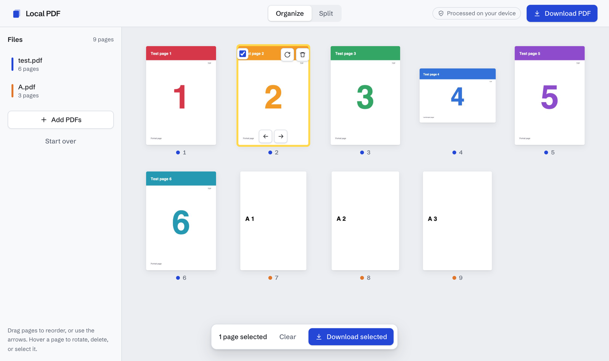
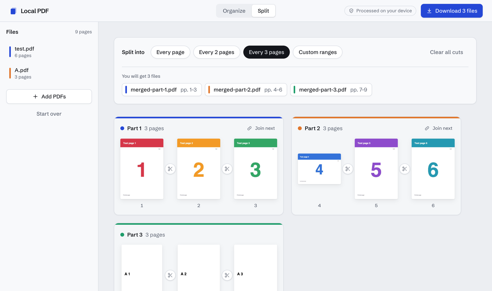

# Local PDF

Merge, split, reorder, rotate, and remove PDF pages in the browser. Files are processed on your device and never uploaded, and the app works offline after the first visit.

**Live:** _add URL after deploy_



## Features

- **Merge:** open several PDFs; their pages land in one grid, colour-coded by source file.
- **Organize:** drag pages to reorder (or use the arrow buttons), rotate, delete, and select pages to export.
- **Split:** cut between any two pages, or split every page / every N pages / by ranges like `1-3, 5, 8-10`. Each part downloads as its own PDF inside a zip.
- **Private by design:** there is no server. PDFs are read and written in the browser.
- **Offline and installable:** a service worker caches the app, so it keeps working without a connection and can be installed as a PWA.



## How it works

| Concern | Tool |
| --- | --- |
| Reading and writing PDFs | [pdf-lib](https://pdf-lib.js.org) |
| Page previews | [pdf.js](https://mozilla.github.io/pdf.js/), rendered in its web worker |
| Zipping split parts | [fflate](https://github.com/101arrowz/fflate) |
| UI | React 19, TypeScript, Tailwind CSS 4, Vite |
| Offline | vite-plugin-pwa (Workbox) |

The editor never changes the original files. It keeps a list of page references (`source file, page index, extra rotation`) and only builds a new PDF from them when you download.

## Engineering notes

A few decisions that weren't obvious at first:

- **Pages appear before their previews.** Opening a file only reads page sizes with pdf-lib, so the grid shows correctly shaped placeholders immediately. pdf.js then renders previews in the background and they arrive in batches. A 400-page PDF shows its grid in about 100 ms, and the UI stays responsive while previews render.
- **pdf.js gets a copy of the file.** pdf.js transfers the buffer it's given to its worker, which detaches it. Passing it the original would break every later export, so it receives a copy and pdf-lib keeps the original.
- **Cuts belong to pages, not positions.** A split cut is stored as the id of the page it follows. Reordering pages carries the cut along with its page instead of leaving it at a stale position.
- **Heavy libraries load on demand.** pdf-lib, pdf.js, and fflate are dynamically imported the first time they're needed, which cut the initial JavaScript from about 1.1 MB to 245 KB.
- **Page moves are not animated.** Mode switches and splits use the View Transitions API, but during a view transition the browser routes every click to the document root. Animating moves meant fast repeated clicks on the arrow buttons were silently dropped, so moves apply instantly.

## Development

```sh
yarn install
yarn dev       # start the dev server
yarn test      # run the PDF and split logic checks
yarn build     # type-check and build to dist/
yarn lint
```

Deploys to Netlify with the included `netlify.toml`.

## Known limitations

- Bookmarks (outlines) and links between pages are not carried over when pages are copied into a new PDF.
- Password-protected PDFs can't be opened; remove the password first.
- Drag-and-drop reordering isn't available on touch screens. Use the arrow buttons instead.

## License

[MIT](LICENSE)
